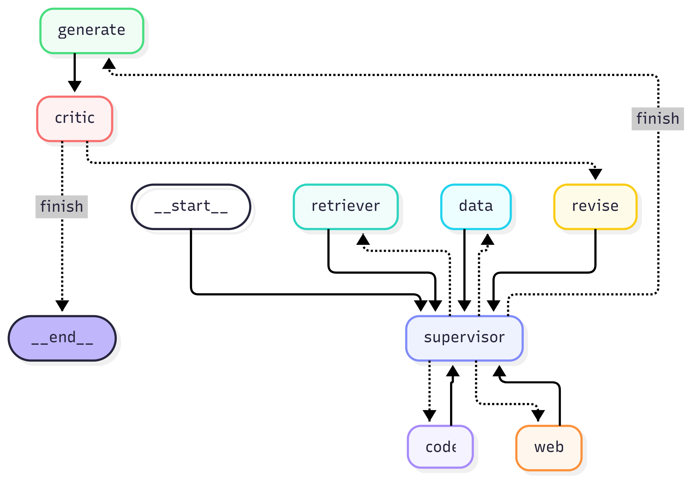
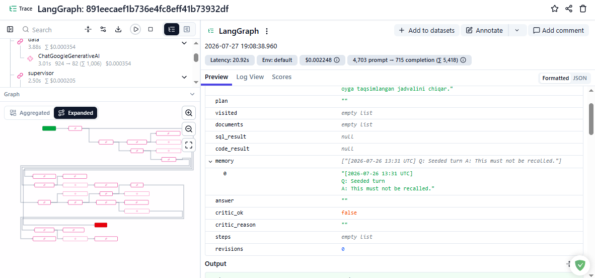
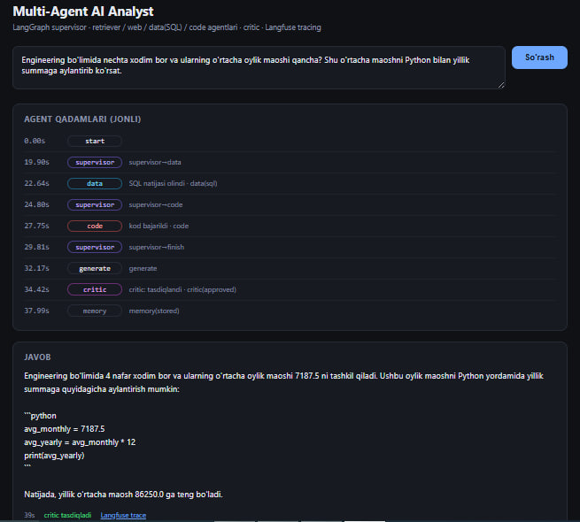

# Multi-Agent AI Analyst

A LangGraph multi-agent system that answers questions requiring **several different
kinds of evidence at once** — a document lookup, a database query, and a calculation —
by routing each part to a specialist agent, then verifying the drafted answer before
returning it.

Built as a capstone against a 14-feature rubric (F1–F14). **Score: 100 / 100.**

---

## Live demo

| | URL |
|---|---|
| Frontend (Next.js, streaming UI) | https://capstone-multi-agent-analyst.vercel.app |
| Backend API (FastAPI, SSE) | https://multi-agent-ai-analyst-api.onrender.com |
| Health check | https://multi-agent-ai-analyst-api.onrender.com/api/health |

> The backend runs on Render's free tier, which sleeps after ~15 minutes of inactivity.
> The **first** request after a period of silence takes 30–60 seconds to wake the
> instance; every request after that is fast. Open the health check first if you want
> the demo to respond immediately.

Try a question that needs more than one agent, for example:

> *Engineering bo'limida nechta xodim bor va ularning o'rtacha oylik maoshi qancha?
> Shu o'rtacha maoshni Python bilan yillik summaga aylantirib ko'rsat.*

The UI shows each agent as it acts (`supervisor → data → code → critic`), with elapsed
time per step and a link to the Langfuse trace for that exact run.

---

## Architecture



```
START → supervisor
supervisor --(plan)--> retriever | web | data | code | generate
retriever | web | data | code → supervisor
generate → critic
critic --(verdict)--> END | revise
revise → supervisor
```

| Node | Role |
|---|---|
| `supervisor` | Reads the question and picks the next specialist |
| `retriever` | RAG over the company handbook (Qdrant) |
| `web` | Tavily search for anything outside the corpus |
| `data` | Text-to-SQL against a read-only SQLite database |
| `code` | Runs Python in a sandbox for calculations and tables |
| `generate` | Drafts the answer from the accumulated evidence |
| `critic` | Verifies grounding and either approves or forces a revision |

### Three design decisions worth naming

**Routing is a suggestion, enforcement is deterministic.** The supervisor is an LLM, so
it can propose anything — including an agent that already ran. `enforce_route()` is a
pure function that normalises the label, rejects anything outside the route set, refuses
to re-select an agent in `state["visited"]`, and returns `finish` once every specialist
has run. Termination is therefore **structural, not behavioural**: a model that answers
`data` forever still cannot exceed four agent hops.

**The recursion limit is computed, not guessed.** `required_recursion_limit()` derives
the true worst case from the agent count and the revision cap (39 for four agents and
`max_revisions=2`); `safe_recursion_limit()` raises the configured value if it is lower.
A limit set too low aborts legitimate work instead of catching a runaway.

**Memory lives outside the graph.** Recall happens before routing (the condensed
question must be settled before the supervisor sees it) and writing happens after the
critic approves. Only verified answers are stored — a rejected answer written to memory
would come back later as evidence and compound.

---

## Security

The rubric requires that model-generated SQL and model-generated Python cannot damage
anything. Both are enforced in code, not by prompting.

### Text-to-SQL — four independent layers (`ai/db.py`)

1. **Comments rejected, not stripped.** A query containing `--`, `/*` or `*/` is
   refused outright. Stripping a comment means trusting our own stripper; an attacker
   only has to out-think it once.
2. **Single statement.** A `;` inside the query is rejected, blocking
   `SELECT ...; DROP ...`.
3. **Read statements only.** Must start with `SELECT`/`WITH`, and no write, DDL or
   engine keyword may appear anywhere (word-boundary scan, so `updated_at` is not a
   false positive).
4. **OS-level read-only.** SQLite is opened via the URI `file:<path>?mode=ro`.

`scripts/check_f5.py` demonstrates **10/10 malicious statements rejected** and a write
attempt failing at the SQLite level.

### Code agent — sandboxed (`ai/sandbox.py`)

1. **Static AST analysis before execution.** Stdlib whitelist only; `open`, `eval`,
   `exec`, `getattr` and all dunder access (`__class__`, `__subclasses__`) rejected.
2. **Process isolation.** A separate `python -I -B` interpreter, a throwaway temp
   directory, a scrubbed environment (no API keys reach the child), a hard wall-clock
   timeout and capped output.

`scripts/check_f6.py` demonstrates **13/13 attacks rejected**, an infinite loop killed
at the 3-second cap, and zero secrets in the child environment.

---

## Evaluation

12 questions (4 document, 4 SQL, 2 code, 2 mixed), each with a reference answer and
checkable facts drawn from the handbook or the seeded database. Three metric families
that measure genuinely different things:

- **Exact match** — free and deterministic; cannot be talked into a better score.
- **LLM judge (1–5)** — is the answer actually *correct* against the reference?
- **RAGAS** — is it *grounded*, and was the right evidence gathered?

The harness runs the same questions with the critic enabled and disabled
(`build_graph(use_critic=False)`), and every result is cached to disk the moment it
completes, so an exhausted daily quota never means starting over.

### Results — with vs without the critic

| Metric | With critic | Without critic | Delta |
|---|---|---|---|
| Questions evaluated | 12 | 12 | +0.000 |
| Exact match rate | 0.833 | 1.000 | **−0.167** |
| LLM judge mean (1–5) | 4.500 | 5.000 | **−0.500** |
| RAGAS faithfulness | 0.917 | 1.000 | −0.083 |
| RAGAS answer_relevancy | 0.878 | 0.983 | −0.105 |
| RAGAS context_precision | 0.750 | 0.808 | −0.058 |
| RAGAS context_recall | 0.833 | 1.000 | −0.167 |
| Mean revisions | 0.000 | 0.000 | +0.000 |
| Mean seconds per question | 15.230 | 16.580 | −1.350 |
| Critic-verified rate | 1.000 | n/a | n/a |

Both columns are backed by a full 12/12 samples. Full report:
[`documents/eval_results.md`](documents/eval_results.md).

### The headline finding: the critic made results *worse*

On every metric. This is reproducible, not an artefact, and it is the most interesting
result in the project — so it is reported rather than hidden.

The mechanism is visible in the failure analysis below. The critic approved **every**
answer it saw (`critic-verified rate 1.000`) and forced **zero** revisions
(`mean revisions 0.000`), so it added no corrections. What it did add was a second
generation step whose framing nudged answers toward the evidence that happened to be
in the state — including evidence that was wrong for the question. A verifier that
never rejects anything is not neutral; it is a bias amplifier.

---

## Error analysis — 3 failures, one fix each

Full entries with traces: [`documents/eval_results.md`](documents/eval_results.md).

### 1. `q03` — supervisor routed a policy question to the database

*"What is the first response target for a severity 1 support ticket?"*
Expected **1 hour** (a written policy). Got **40.0 minutes** (the SQL *average actual*
response time).

The retriever was tried first and failed with a transient
`GoogleGenerativeAIError`; the supervisor then routed to `data`, which answered a
different question with real numbers. The critic approved it: *"accurately reflects the
average first response time calculated from the provided evidence."*

**Fix:** an agent that errors must be recorded as *no evidence gathered* and retried or
re-routed, not silently passed over. Right now a failed agent and an agent that ran and
found nothing are indistinguishable downstream.

### 2. `q12` — the data agent answered a different question

*"How many employees are in Engineering, and how many annual leave days do they get?"*
Expected 4 employees and **24 days** (the entitlement, from the handbook). Got 4
employees and **29 days** — a `SUM` over historical `leave_requests` rows.

**Fix:** classify each sub-question by evidence type before delegating. "How many days
do they *get*" is an entitlement (document); "how many days did they *take*" is a
measurement (database). The supervisor currently sees only surface keywords.

### 3. `q_extra` — the code agent fabricated its own data

*"Engineering bo'limida nechta xodim bor..."* — the `data` agent had **already** put the
correct result in the state:

```sql
SELECT COUNT(e.id), AVG(e.annual_salary_eur), AVG(e.annual_salary_eur)/12
FROM employees e JOIN departments d ON e.department_id = d.id
WHERE d.name = 'Engineering' AND e.is_active = 1
-- → 4 | 86250.0 | 7187.5
```

The `code` agent ignored it and invented a sample list instead:

```python
employees = [
    {"name": "Ali",  "department": "Engineering", "salary": 1200},
    {"name": "Vali", "department": "Engineering", "salary": 1500},
    {"name": "Gani", "department": "Engineering", "salary": 1800},
    {"name": "Soli", "department": "Sales",       "salary": 1000},
]
```

Final answer: **3 employees, 1500.0** — contradicting a correct SQL result sitting in
the same state. The critic approved it: *"accurately reflects the code-based evidence
provided."*

**Fix:** pass `sql_result` into the code agent's prompt as the authoritative input and
forbid inventing data when a prior result exists.

### The shared root cause

All three failures have the same shape. The critic checks **grounding** — does the
answer match the evidence it was shown? — but never checks **relevance** (is this the
right evidence for this question?) or **consistency** (does this evidence contradict
other evidence already in the state?).

If a wrong agent produces wrong-but-real data and the generator reports it faithfully,
the critic approves. That single blind spot explains all three failures *and* the
negative deltas in the metrics table.

**Proposed fix:** show the critic *every* populated evidence field (`documents`,
`sql_result`, `code_result`) rather than only the one used, and add two explicit checks
to its rubric — "is this evidence the right kind for this question?" and "do any two
evidence sources disagree?"

---

## Observability

Every run is traced to Langfuse through the `callbacks` parameter already exposed by
`ai/graph.py`, so no graph rewiring was needed.



A single complex question produces 27 observations — the full path
(`supervisor → data → code → generate → critic`) with 7 LLM generations, 5,418 tokens
and per-node cost. Every answer returned by the API includes the trace URL for that run,
which is how failure 3 above was diagnosed.

> **Gotcha worth recording:** Langfuse ingestion is asynchronous. Querying
> `api.trace.get()` immediately after a run returns the trace with **zero**
> observations. `ai/observability.py` polls until observations appear rather than
> trusting the first response.

---

## Live multi-agent trace (frontend)



The backend streams Server-Sent Events; the frontend renders each agent step as it
arrives. Steps appear spread across ~19 seconds, well before the final answer — verified
by `scripts/check_f13.py`, which fails the run if the events arrive bunched together
(which would mean a buffered response pretending to stream).

---

## Stack

| Layer | Choice |
|---|---|
| Orchestration | LangGraph |
| LLM + embeddings | Google Gemini (`gemini-3.1-flash-lite`, `models/gemini-embedding-001`, dim 3072) |
| Vector store | Qdrant Cloud (separate collections for documents and memory) |
| Database | SQLite, opened read-only |
| Web search | Tavily (optional — skips gracefully without a key) |
| Tracing | Langfuse |
| Evaluation | RAGAS + LLM judge |
| Backend | FastAPI + SSE, deployed on Render |
| Frontend | Next.js, deployed on Vercel |

The embedding dimension is never hard-coded: `embedding_dimension()` probes the live
model once and creates the collection at exactly that size, so swapping the embedding
model can never cause a dimension mismatch.

---

## Running it locally

```powershell
git clone https://github.com/amuminov337-pro/multi-agent-ai-analyst.git
cd multi-agent-ai-analyst

python -m venv venv
.\venv\Scripts\Activate.ps1
pip install -r requirements.txt

copy .env.example .env      # then fill in your own keys
python scripts\seed_db.py   # rebuild data/company.db
python scripts\check_f1.py  # verify config + state + a live model call
```

Backend and frontend, in two terminals:

```powershell
uvicorn backend.app:app --port 8000
```

```powershell
cd frontend
npm install
npm run dev                 # http://localhost:3000
```

### Verification scripts

Every feature has a script that demonstrates its "done when" condition live:

```powershell
python scripts\check_f1.py    # config + shared state + live model call
python scripts\check_f2.py    # ingestion + similarity search
python scripts\check_f3.py    # retriever alone
python scripts\check_f4.py    # web agent, with and without a key
python scripts\check_f5.py    # text-to-SQL + 10 attack rejections
python scripts\check_f6.py    # sandbox + 13 attack rejections + timeout
python scripts\check_f7.py    # supervisor routing + 14 guard cases
python scripts\check_f8.py    # critic verdicts + revision cap
python scripts\check_f9.py    # graph end-to-end + writes the diagram
python scripts\check_f10.py   # memory store / recall / condense / poison guard
python scripts\check_f11.py   # evaluation rubric conditions
python scripts\check_f12.py   # Langfuse trace with the full path + tokens
python scripts\check_f13.py   # SSE streaming (server must be running)
python scripts\check_f14.py --api <render-url> --web <vercel-url>
```

Diagnostics that cost nothing:

```powershell
python scripts\probe_models.py     # which Gemini models actually respond
python scripts\probe_ragas.py      # does RAGAS import behind the compat shim
python scripts\probe_langfuse.py   # inspect a trace's observations and tokens
python scripts\probe_failures.py --sql-only   # ground truth from the database
```

### API

| Endpoint | Purpose |
|---|---|
| `GET /api/health` | Liveness plus tracing status |
| `GET /api/stream?question=` | SSE stream of live agent steps |
| `POST /api/ask` | Single JSON response, no streaming |
| `GET /api/graph` | Mermaid source for the graph diagram |

---

## Feature scorecard

| Phase | Features | Points |
|---|---|---|
| 1 · Foundation | F1 shared state · F2 ingestion + vector store | 15 |
| 2 · Specialist agents | F3 retriever · F4 web · F5 data/SQL · F6 code | 30 |
| 3 · Orchestration | F7 supervisor · F8 critic · F9 graph | 25 |
| 4 · Memory & evaluation | F10 long-term memory · F11 eval harness | 15 |
| 5 · Ship | F12 Langfuse · F13 streaming frontend · F14 deployment | 15 |
| | **Total** | **100 / 100** |

Feature-by-feature detail: [`PROGRESS.md`](PROGRESS.md).

---

## Repository layout

```
ai/                 # agents, graph, memory, evaluation, observability
├── agents/         # retriever, web, data_sql, code_agent, supervisor, critic, generate
├── db.py           # read-only SQLite + four-layer query guard
├── sandbox.py      # AST guard + process isolation + runtime cap
├── graph.py        # build_graph, run, stream, mermaid_diagram
└── observability.py# Langfuse callbacks (F12)
backend/            # FastAPI + SSE
frontend/           # Next.js streaming UI
scripts/            # check_f1 … check_f14, seeds, probes, eval harness
documents/          # corpus, eval questions, results, submission visuals
render.yaml         # Render Blueprint (backend deployment)
```

Secrets live in `.env`, which is git-ignored and has never been committed.
`.env.example` lists every variable with empty values.